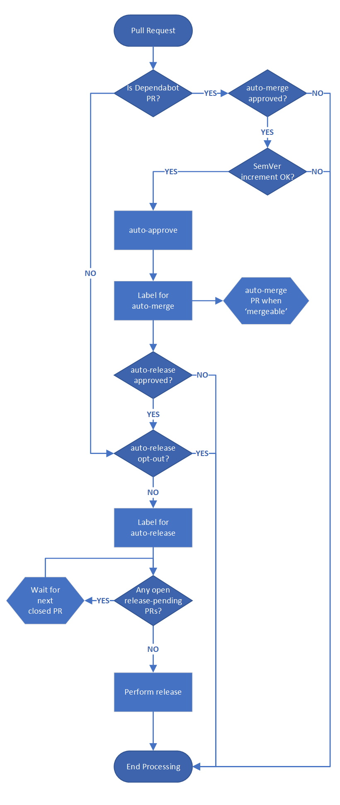

# pr-autoflow


[](https://raw.githubusercontent.com/corvus-dotnet/Corvus.Deployment/master/LICENSE)

This repo contains 3 docker-based GitHub actions that can be used to enable continuous integration for a configurable subset of .NET dependencies being managed by [GitHub Dependabot](https://github.blog/2020-06-01-keep-all-your-packages-up-to-date-with-dependabot/).

## Overview

Whilst tools like Dependabot simplify the process of testing updates to a repository's package dependencies, there can still be signficant coordination work to apply such changes and have the resulting updates cascade through the rest of your software estate.

The GitHub actions detailed below provide the plumbing to enable the following features:
1. The ability to identify which dependencies are being updated and the 'scale' of the update, in terms of the [semantic version](https://semver.org) increment
1. A policy-based approach for managing which dependencies are approved for being automatically merged
1. The ability to batch multiple, auto-mergeable dependency updates into a single release 'event'

The following repos are examples of how these actions can be integrated into a broader CI/CD and dependency management workflow (and serve as examples of the configuration required by these actions):
* [corvus-dotnet/Corvus.Testing](https://github.com/corvus-dotnet/Corvus.Testing/tree/master/.github)
* [menes-dotnet/Menes](https://github.com/menes-dotnet/Menes/tree/master/.github)
* [marain-dotnet/Marain.Tenancy](https://github.com/marain-dotnet/Marain.Tenancy/tree/master/.github)

***NOTE**: The workflows in those repos are available as templates and documented [here](https://github.com/endjin/.github/blob/master/workflow-templates/README.md)*

Finally, an [Architecture Decision Record](docs/adr/0001-automated-dependency-release-management.md) captures the design intent behind the workflows implemented above and is illustrated in the diagram below:




## Prerequisites

The configuration of [GitHub Dependabot](https://github.blog/2020-06-01-keep-all-your-packages-up-to-date-with-dependabot/) is outside the scope of this README and is assumed to be setup and working correctly for the repository.


## Actions
This section documents each of the GitHub actions contained in this repo.

### read-configuration

A GitHub action that reads a JSON file from the current repo and makes the contained values available via workflow output variables.

#### Inputs
The action supports the following inputs.

|Name | Required? | Description
|-----|-----------|------------
|config_file| Y | The path of the JSON configuration file to read, relative to root of the repo

#### Outputs
The action emits the following static output.

|Name | Description
|-----|------------
|configJson| The raw JSON of the input file

In addition, the action emits dynamic outputs based on the keys from the input JSON document.

#### Example Usage

Given the following configuration file exists in the repo.
```json
{
  "setting1": "some value",
  "setting2": "another value"
}
```

The following set of steps will surface those settings within a workflow.
```yaml
steps:
  - uses: actions/checkout@v2

  - name: Read pr-autoflow configuration
    id: get_config
    uses: endjin/pr-autoflow/actions/read-configuration@v1
    with:
      config_file: .github/config/myconfig.json
  
  - name: Log configuration settings
    id: log_config_settings
    run: |
    with:
      echo "setting1 : ${{ steps.get_config.outputs.setting1 }}"
      echo "setting2 : ${{ steps.get_config.outputs.setting2 }}"

```


### dependabot-pr-parser

A GitHub action that extracts information about a [Dependabot](https://docs.github.com/en/github/administering-a-repository/about-github-dependabot-version-updates) PR from its convention-based title.

Using this information it applies a policy based on the package name to determine whether the PR is 'interesting' (as defined by the caller).  In practise, we might define a policy that says all updates to NUnit packages (`NUnit.*`) can be automatically merged.

This action therefore enables us to identify Dependabot updates to all NUnit packages as they are created and react accordingly, for example:
* Have a bot auto-approve the PR
* Label the PR with 'auto-merge'

#### Inputs
The action supports the following inputs.

|Name | Required? | Description
|-----|---------|------------
|pr_title| Y |The title of the PR to be parsed
|package_wildcard_expressions| N |A JSON-formatted array of wildcard patterns for dependencies that should be flagged as interesting (e.g. candidates for auto-merging later in the workflow)

#### Outputs
The action emits the following output variables.

|Name | Description
|-----|------------
|dependency_name|The package name of the dependency being updated by Dependabot
|from_version|The current version of the dependency
|to_version|The version Dependabot wants to upgrade the dependency to
|folder|The folder where the dependency is updated.
|update_type|The scale of SemVer update being proposed. Possible values: `major`, `minor` or `patch`
|is_matching_package|True when the PR refers to a package that matches any of the provided package name wildcard patterns

#### Example Usage

```yaml
name: sample
on: 
  pull_request:
    types: [opened, reopened]
jobs:
  evaluate_dependabot_pr:
    runs-on: ubuntu-latest
    name: Parse Dependabot PR title
    outputs:
      dependency_name: ${{ steps.parse_dependabot_pr_automerge.outputs.dependency_name }}
      version_from: ${{ steps.parse_dependabot_pr_automerge.outputs.version_from }}
      version_to: ${{ steps.parse_dependabot_pr_automerge.outputs.version_to }}
      is_auto_merge_candidate: ${{ steps.parse_dependabot_pr_automerge.outputs.is_interesting_package }}
      is_auto_release_candidate: ${{ steps.parse_dependabot_pr_autorelease.outputs.is_interesting_package }}
      semver_increment: ${{ steps.parse_dependabot_pr_automerge.outputs.semver_increment }}
    steps:
      - uses: actions/checkout@v2

      - name: Read pr-autoflow configuration
        id: get_pr_autoflow_config
        uses: endjin/pr-autoflow/actions/read-configuration@v1
        with:
          config_file: .github/config/pr-autoflow.json

      - name: Dependabot PR - AutoMerge Candidate
        id: parse_dependabot_pr_automerge
        uses: endjin/pr-autoflow/actions/dependabot-pr-parser@v1
        with:
          pr_title: ${{ github.event.pull_request.title }}
          package_wildcard_expressions: ${{ steps.get_pr_autoflow_config.outputs.AUTO_MERGE_PACKAGE_WILDCARD_EXPRESSIONS }}

      - name: Dependabot PR - AutoRelease Candidate
        id: parse_dependabot_pr_autorelease
        uses: endjin/pr-autoflow/actions/dependabot-pr-parser@v1
        with:
          pr_title: ${{ github.event.pull_request.title }}
          package_wildcard_expressions: ${{ steps.get_pr_autoflow_config.outputs.AUTO_RELEASE_PACKAGE_WILDCARD_EXPRESSIONS }}

      - name: debug
        run: |
          echo "dependency_name : ${{ steps.parse_dependabot_pr_automerge.outputs.dependency_name }}"
          echo "is_auto_merge_candidate : ${{ steps.parse_dependabot_pr_automerge.outputs.is_interesting_package }}"
          echo "is_auto_release_candidate : ${{ steps.parse_dependabot_pr_autorelease.outputs.is_interesting_package }}"
          echo "semver_increment : ${{ steps.parse_dependabot_pr_automerge.outputs.semver_increment }}"
```


### dependabot-pr-watcher

This GitHub action performs a similar job to `dependabot-pr-parser` except it is able to operate on multiple [Dependabot](https://docs.github.com/en/github/administering-a-repository/about-github-dependabot-version-updates) pull requests.

This is useful as it enables workflows to understand whether any of the other open pull requests are also auto-merge candidates, thus allowing such updates to be treated as a batch where appropriate.

#### Inputs
The action supports the following inputs.

|Name | Required? | Description
|-----|---------|------------
|pr_titles| Y |Stringified JSON array of PR titles.
|max_semver_increment| N | The maximum SemVer increment to watch for.
|package_wildcard_expressions| N |Stringified JSON array of wildcard expressions used to filter which dependencies to watch for

#### Outputs
The action emits the following output variables.

|Name | Description
|-----|------------
|is_complete|True when there no open, matching Dependabot PRs.

#### Example Usage

```yaml
name: sample
on: 
  pull_request:
    types: [closed]
jobs:
  check_ready_to_release:
    runs-on: ubuntu-latest
    outputs:
      no_open_prs: ${{ steps.watch_dependabot_prs.outputs.is_complete }}
    steps:
    - name: Get Open PRs
      id: get_open_pr_list
      uses: actions/github-script@v2
      with:
        github-token: ${{ secrets.GITHUB_TOKEN }}
        script: |
          const pulls = await github.pulls.list({
            owner: context.payload.repository.owner.login,
            repo: context.payload.repository.name,
            state: 'open',
            base: 'master'
          });
          return JSON.stringify(pulls.data.map(p=>p.title))
        result-encoding: string
    
    - name: Display open_pr_list
      run: |
        echo "open_pr_list : ${{ steps.get_open_pr_list.outputs.result }}"
       
    - uses: actions/checkout@v2
    
    - name: Read pr-autoflow configuration
      id: get_pr_autoflow_config
      uses: endjin/pr-autoflow/actions/read-configuration@v1
      with:
        config_file: .github/config/pr-autoflow.json

    - name: Watch Dependabot PRs
      id: watch_dependabot_prs      
      uses: endjin/pr-autoflow/actions/dependabot-pr-watcher@v1
      with:
        pr_titles: ${{ steps.get_open_pr_list.outputs.result }}
        package_wildcard_expressions: ${{ steps.get_pr_autoflow_config.outputs.AUTO_MERGE_PACKAGE_WILDCARD_EXPRESSIONS }}
        max_semver_increment: minor
        verbose_mode: 'False'

    - name: Display job outputs
      run: |
        echo "no_open_automerge_candidate_prs: ${{ steps.watch_dependabot_prs.outputs.is_complete }}"
```


## Licenses

[](https://raw.githubusercontent.com/endjin/Stacker/master/LICENSE)

This project is available under the Apache 2.0 open source license.

For any licensing questions, please email [&#108;&#105;&#99;&#101;&#110;&#115;&#105;&#110;&#103;&#64;&#101;&#110;&#100;&#106;&#105;&#110;&#46;&#99;&#111;&#109;](&#109;&#97;&#105;&#108;&#116;&#111;&#58;&#108;&#105;&#99;&#101;&#110;&#115;&#105;&#110;&#103;&#64;&#101;&#110;&#100;&#106;&#105;&#110;&#46;&#99;&#111;&#109;)

## Project Sponsor

This project is sponsored by [endjin](https://endjin.com), a UK based Microsoft Gold Partner for Cloud Platform, Data Platform, Data Analytics, DevOps, a Power BI Partner, and .NET Foundation Corporate Sponsor.

We help small teams achieve big things.

For more information about our products and services, or for commercial support of this project, please [contact us](https://endjin.com/contact-us). 

We produce two free weekly newsletters; [Azure Weekly](https://azureweekly.info) for all things about the Microsoft Azure Platform, and [Power BI Weekly](https://powerbiweekly.info).

Keep up with everything that's going on at endjin via our [blog](https://blogs.endjin.com/), follow us on [Twitter](https://twitter.com/endjin), or [LinkedIn](https://www.linkedin.com/company/1671851/).

Our other Open Source projects can be found on [our website](https://endjin.com/open-source)

## Code of conduct

This project has adopted a code of conduct adapted from the [Contributor Covenant](http://contributor-covenant.org/) to clarify expected behavior in our community. This code of conduct has been [adopted by many other projects](http://contributor-covenant.org/adopters/). For more information see the [Code of Conduct FAQ](https://opensource.microsoft.com/codeofconduct/faq/) or contact [&#104;&#101;&#108;&#108;&#111;&#064;&#101;&#110;&#100;&#106;&#105;&#110;&#046;&#099;&#111;&#109;](&#109;&#097;&#105;&#108;&#116;&#111;:&#104;&#101;&#108;&#108;&#111;&#064;&#101;&#110;&#100;&#106;&#105;&#110;&#046;&#099;&#111;&#109;) with any additional questions or comments.
